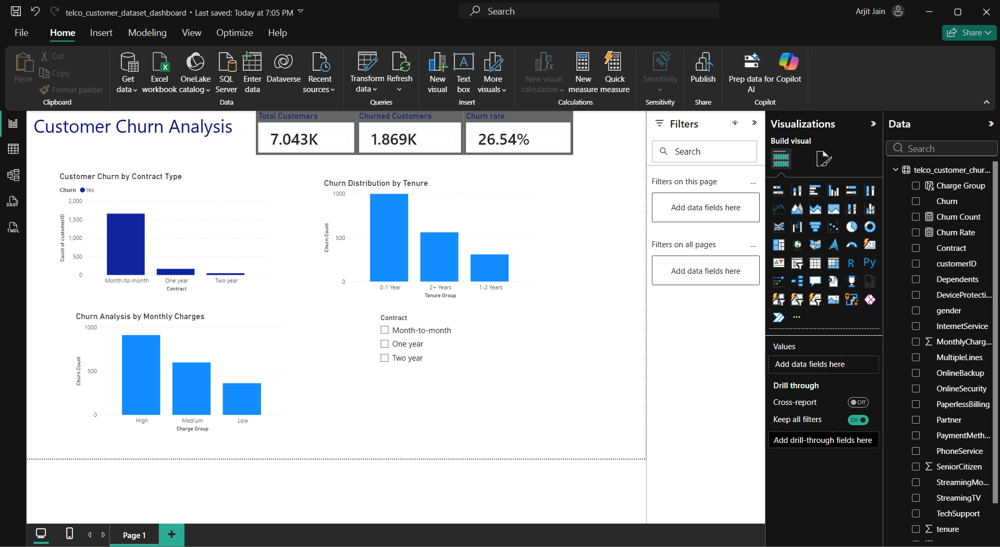

# Churn Analysis Dashboard

## 🔍 Project Workflow

1. Data Cleaning using SQL  
2. Exploratory Data Analysis  
3. Churn Segmentation (Contract, Tenure, Charges)  
4. Visualization using Power BI  
5. Business Insights & Recommendations

---

## 📌 Overview
In this task, the activity of those clients who have terminated service is analyzed with the help of SQL and Power BI. Several critical features influencing the retention of clients are defined.

---

## 📊 Key Insights
- The total churn rate is **26.54%**, i.e., from four clients, one terminates services
- Customers having a month-to-month contract (**42.71%**) face churn mostly
- New customers with a **0-1 year tenure** experience more churns (48.28%)
- Customers facing high monthly fees terminate services

---

## 💡 Recommendations for business
- Make long-term contracts to avoid churn
- Improve the integration of new customers with services
- Create pricing policies for retaining loyal customers
- Use packages in order to develop the loyalty of customers

---

## 🛠️ Tools
- SQL (MySQL)
- Power BI

---

## 📈 Dashboard Features
- KPI Cards (Total Customers, Churned Customers, Churn Rate)
- Churn Analysis (by Contract, Tenure, and Monthly Charges)
- Interactive Filters

---

  
## 📊 Dashboard Preview

---

## 💼 Skills Demonstrated

- Data Analysis  
- SQL  
- Data Visualization  
- Business Insight Generation  
- Problem Solving

---

## 📂 Files
- Power BI Dashboard (.pbix)
- Dataset (CSV)

---

## 🚀 Conclusion
In the current project, the data analytics methods helped to define patterns of customer churn and offer recommendations to prevent this phenomenon.
